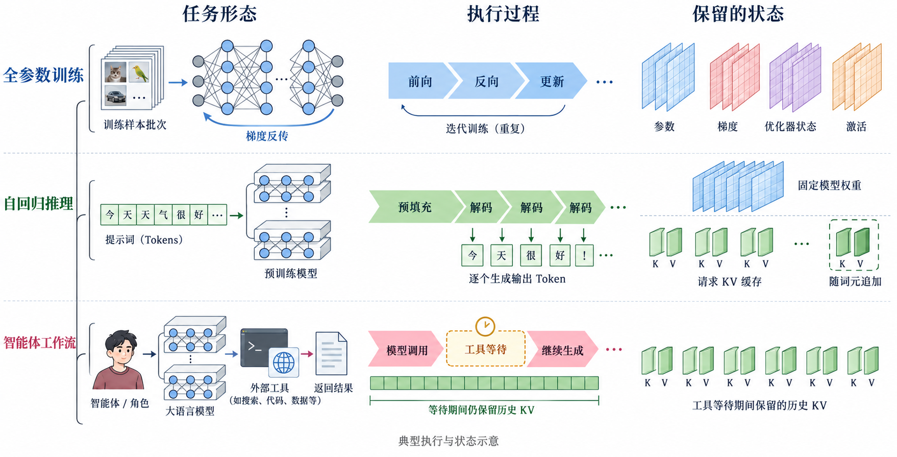

# Systems Figure Studio

[English](README.md) · [技能入口](SKILL.md) · [离线画法浏览](guide.html) · [完整案例](examples/showcase.md)

面向计算机系统与 AI Infrastructure 研究的论文配图技能。依据文稿设计、生成和重绘架构、机制、资源、执行过程及研究关系图，同时支持会议论文、期刊论文和博士学位论文，自动依据目标章节、正文及图题选择中文或英文标签；用户明确的语言要求优先，聊天语言不决定成图语言。



这是一幅项目生成示意图，不是实验结果。工具等待时保留 KV 是图中选定的策略示例，不能推断所有系统均如此。

## 能做什么

- 查阅 12 个主题、122 个词条、273 种文字构造，组合模型、硬件、调度、推理、Agent 等对象。
- 绘图前展示构图、元素选择和实际完整 Prompt；成图后检查语义、造型、颜色与论文尺度可读性。
- 现有画法不合适时，使用可用图像工具定制局部元素或生成整图。
- 将生成素材导入 draw.io/PPT，与独立文字、箭头、状态和布局组成可编辑文档；仅明确要求时重建全部内部矢量形状。

273 种指文字画法，不代表已有 273 张素材图。实际视觉素材单独登记，SVG 内嵌像素与原生矢量明确区分。SKILL.md 是唯一的英文执行入口，多数主题词条与辅助参考保留中文；入门说明提供中英文版本，图中标签根据目标文稿自动采用中文或英文。

## 安装与调用

本仓库根目录就是一个完整 skill，无需构建。取得仓库后，将目录命名为 `systems-figure-studio` 并放入宿主支持的 skill 目录。本项目本地使用 `~/.agents/skills/systems-figure-studio`；其他宿主使用其配置的发现目录。不要在多个发现目录重复安装。必要时刷新技能列表或新建聊天。

首次安装可直接克隆到技能目录（目标目录需尚不存在）：

```bash
git clone https://github.com/Jinghao-coding/systems-figure-studio.git ~/.agents/skills/systems-figure-studio
```

已有安装时，在该目录先用 `git status` 检查本地修改，再用 `git pull --ff-only` 更新；不要覆盖本地改动。

```text
使用 $systems-figure-studio，根据附件论文的设计部分绘制架构图。
先展示构图、具体元素画法、配色和完整 Prompt，再生成并检查。
```

```text
使用 $systems-figure-studio，把这张英文机制图重绘为中文大论文配图。
保留技术含义，按需生成局部元素，交付可编辑 draw.io 文件和预览图。
```

规划与查词条只需读取材料；生图需要可用且授权的图像工具；draw.io/PPT 制作需要相应工具或文件生成能力。本仓库不包含 MCP 服务，也不自动安装插件或配置密钥。工具缺失时应报告实际限制。

## 维护与验证

索引与结构检查仅需 Python 3.10+ 标准库：

```bash
python3 scripts/rebuild_navigation.py
python3 scripts/validate.py
python3 scripts/check_release.py
```

主题正文为画法维护源，catalog 与 guide.html 为派生检索资料。裁白边脚本可选依赖 Pillow，PDF 检查可选依赖 PyMuPDF；需要时在项目虚拟环境中安装。结构检查通过不代表图面美观或科学内容已验收。

参见 [贡献说明](CONTRIBUTING.md)、[发布检查](RELEASE_CHECKLIST.md) 和 [来源与许可](THIRD_PARTY_NOTICES.md)。原创技能文本与脚本采用 MIT；外部作品保留各自许可，项目素材范围见 [素材说明](assets/visual-library/RIGHTS.md)。

当前版本 0.1.0，作为独立开源项目的首版准备。
