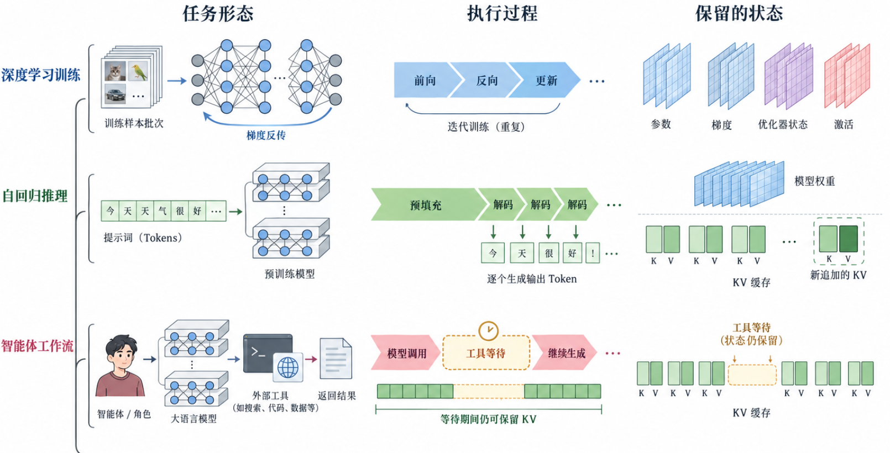

# Worked examples / 实际案例

These are existing project artifacts, not freshly generated outputs or published-paper claims. Only the recorded revision prompt below is available; image generation is nondeterministic, so it supports workflow reproduction rather than pixel-identical results.

## Complete cross-topic case status

The new A/B/C trial figures were withdrawn following user review and are not included as completed cases. Their [synthetic inputs](scenarios/README.md) remain available for future redesign. The historical examples below are preserved with their original scope.

## 1. Correct a training / inference / Agent comparison

**Brief:** Compare task objects, execution phases and retained state in three rows. Use recognizable sample pages, network/model structures and an Agent/tool scene. This is an illustrative explanation, not measured performance or a universal memory policy.

**Before:** The generated concept incorrectly used gaps in the KV depiction to represent tool-wait time.

**Actual recorded edit prompt:** [完整修订 Prompt](../assets/visual-library/mixed-task-scenes-unified-prompt.txt). Supply the before-image as the reference input; preserve its useful objects, separate model weights from request KV, and show continuous retained KV during the example tool wait.

**After:**

**Review:** The wait state and continuous retained KV are now separately depicted. Tensor/page counts and geometry are schematic. Labels remain embedded pixels. The diagram needs document-specific semantic and typography review before publication; it is not an editable vector deliverable.

## 2. Reuse independent elements in an editable document

The [element gallery](../assets/visual-library/mixed-task-elements/index.html) includes sample pages, a neural network, a layered model, token strips, an Agent role, tools and a document. Inspect the [manifest](../assets/visual-library/mixed-task-elements/manifest.json) before reuse.

Select a complete object, insert its SVG wrapper as a separate image object, then add native labels and connectors in draw.io/PPT. Preserve the surrounding whitespace and aspect ratio; do not crop away nodes or leave old labels. The wrappers retain PNG pixels, so image placement is editable but the illustrated object's internal strokes are not separate vector objects. The truncated Agent-model asset is reference-only.

## 3. A native editable GPU identity asset

Open [gpu-flat-native.drawio](../assets/visual-library/gpu-flat-native.drawio) in draw.io. It represents a device identity through a PCB, bracket, compute package, memory pieces and contacts. It does not encode resource partitions or exact physical hardware counts.

This is an existing source example, not a newly completed live-editor validation. Its original drawing transcript is unavailable; no reconstructed text is presented as the original prompt. Choose this view only when device identity is the figure's purpose; use resource or execution views when those explain the mechanism better.
